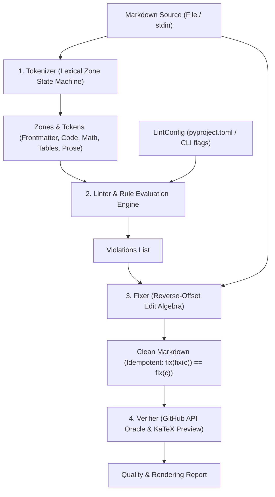

# Architecture & Engine Design

This document describes the internal architecture of **gfm-math-lint**, its compilation model, and how its components interact to inspect, fix, and verify GitHub Flavored Markdown (GFM) documents.

---

## 1. High-Level System Architecture

`gfm-math-lint` processes Markdown documents through four primary decoupled stages:



---

## 2. Component Breakdown

### A. The Tokenizer (`gfm_math_lint.tokenizer`)
Rather than constructing a heavyweight CommonMark Abstract Syntax Tree (AST)—which obscures raw character offsets and strips critical whitespace needed for precise text replacement—`gfm-math-lint` employs an **8-Zone Lexical State Machine**.

#### Semantic Zones (`ZoneType`):
1. `FRONTMATTER`: YAML metadata header delimited by leading `---`.
2. `FENCED_CODE`: Multi-line code blocks bounded by triple-or-greater backticks or tildes.
3. `INLINE_CODE`: Backtick spans within prose or tables (e.g. `` `code` ``).
4. `DISPLAY_MATH`: Math blocks (`$$...$$` or `` ```math `` blocks).
5. `INLINE_MATH`: Inline LaTeX expressions (`$...$`, `\(...\)`, or `` $`...`$ ``).
6. `TABLE`: CommonMark pipe table grids (`| col1 | col2 |`).
7. `COMMENT`: HTML comments (`<!-- ... -->`), including inline suppression directives.
8. `PROSE`: Standard prose paragraphs, lists, and headings.

#### Lexical Scanning Mechanics:
- **Block-level state machine:** Maintains contextual flags across lines (e.g., active code fence delimiter and length, unclosed display math delimiters, multi-line HTML comment spans).
- **Inline scanner:** Evaluates inline tokens within lines while respecting active block states. For example, a `$` character inside a `FENCED_CODE` block is treated purely as literal code, preventing false-positive math linting.

---

### B. The Rule Engine (`gfm_math_lint.rules`)
Rules inherit from the abstract base class `Rule` and operate over segmented zones and tokens:

- **Targeted Execution:** Rules declare which semantic zones they inspect (e.g., `GFM-M03` only inspects math zones; `GFM-T01` only inspects table zones).
- **Severity Levels:** Violations are classified as `Error` or `Warning`.
- **Atomic Fix Delivery:** When a violation is fixable, the rule returns an edit tuple `(start_line, start_col, end_line, end_col, replacement_text)`.

---

### C. The Fixer: Reverse-Offset Edit Algebra (`gfm_math_lint.fixer`)
When multiple rules report violations across a document, applying text edits naively leads to index invalidation: modifying text on line 2 shifts character offsets for all subsequent edits on that line, and adding or removing lines invalidates line numbers for all later lines.

`gfm-math-lint` solves this with a **deterministic reverse-offset edit algebra**:

1. **Sort Order:** All edits are sorted in strict reverse order:
   - Primary: Descending by `start_line` (bottom-up).
   - Secondary: Descending by `start_col` (right-to-left).
2. **Deterministic Mutation:** Because edits are applied from bottom-right to top-left, earlier character columns and preceding line numbers remain untouched throughout the mutation pass.
3. **Idempotency Guarantee:**
   $$\text{fix}(\text{fix}(c)) \equiv \text{fix}(c)$$
   Running `fix` a second time produces an identical output with zero new edits.

---

### D. The Verifier & GitHub API Oracle (`gfm_math_lint.verifier`)
Static linting alone cannot detect subtle browser rendering quirks. The `Verifier` audits markdown against two rendering engines:

1. **Live GitHub REST API Oracle:**
   - Submits document content to GitHub's `/markdown` API endpoint (`mode: "gfm"`).
   - Audits the resulting HTML DOM for:
     - KaTeX errors (`class="katex-error"`).
     - Table fracturing (mismatched column counts across rows).
     - HTML tag collisions (e.g., `<i` or `_` emphasis corrupting math subscripts).
2. **Zero-Red-Box Browser Preview Generator:**
   - Synthesizes standalone preview HTML embedding KaTeX JS and CSS.
   - Normalizes HTML entities inside math spans (`&amp;gt;` → `>`).
   - Suppresses duplicate MathML clipboard pollution by configuring KaTeX to `output: "html"`, ensuring clean rendering across Chromium, Gecko, and WebKit browsers.

---

## 3. Directory Layout

```text
src/gfm_math_lint/
├── __init__.py         # Public exports and version metadata
├── __main__.py         # Direct package invocation entry point (python -m gfm_math_lint)
├── cli.py              # CLI argument parser and command handlers
├── comment.py          # Safe GitHub PR/Issue comment delivery via stdin streaming
├── config.py           # pyproject.toml configuration loader and exclusion filters
├── fixer.py            # Reverse-offset edit algebra and unified diff generator
├── linter.py           # Orchestrator running rules against tokenized documents
├── py.typed            # PEP 561 type annotation marker
├── tokenizer.py        # 8-zone lexical state machine and line scanner
├── verifier.py         # Live GitHub API oracle and KaTeX HTML preview builder
└── rules/              # Modular rule implementations
    ├── __init__.py     # Registry of active rules
    ├── base.py         # Abstract base classes: Rule, Violation, Severity
    ├── code_rules.py   # Fence nesting and inline code backtick rules (GFM-C**)
    ├── diagram_rules.py# Mermaid syntax and fence symmetry rules (GFM-D**)
    ├── image_rules.py  # Image format optimization rules (GFM-I**)
    ├── math_rules.py   # LaTeX, KaTeX, and MathJax rendering rules (GFM-M**)
    ├── shell_rules.py  # Unsafe shell argument scanner (GFM-S**)
    └── table_rules.py  # Table pipe collision rules (GFM-T**)
```
